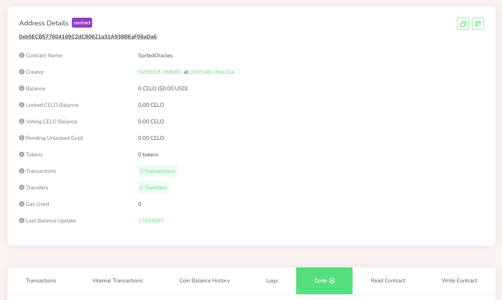
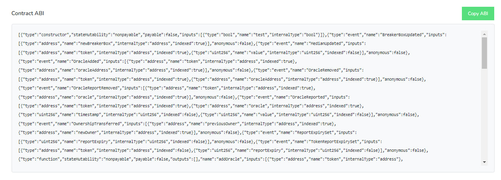
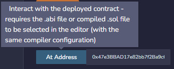
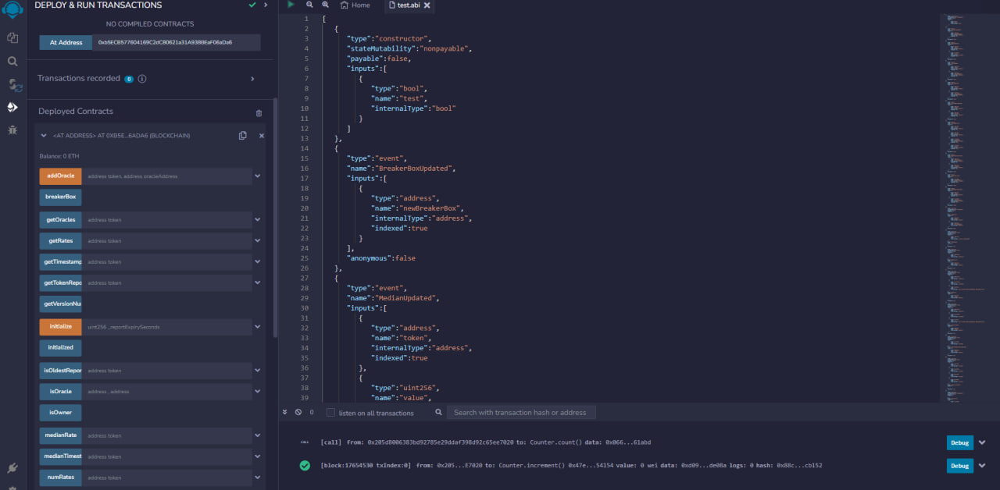

# Using Signatures to Secure a Smart Contract on Celo Network

## Table of Content
- [Using Signatures to Secure a Smart Contract on Celo Network](#using-signatures-to-secure-a-smart-contract-on-celo-network)
  - [Table of Content](#table-of-content)
  - [Introduction](#introduction)
    - [What Is a Signature?](#what-is-a-signature)
    - [What Is Ecdsa Encryption?](#what-is-ecdsa-encryption)
    - [What Is the Purpose of Using Custom Signatures?](#what-is-the-purpose-of-using-custom-signatures)
  - [Requirements](#requirements)
  - [Prerequisites](#prerequisites)
  - [What You Will Learn After This Tutorial](#what-you-will-learn-after-this-tutorial)
  - [What We’ll Be Building](#what-well-be-building)
  - [Preparation](#preparation)
    - [How to access a contract from outside](#how-to-access-a-contract-from-outside)
    - [Creation of a Simple Contract for NFT Minting](#creation-of-a-simple-contract-for-nft-minting)
    - [First Usage Case](#first-usage-case)
    - [Second Usage Case](#second-usage-case)
  - [Conclusion](#conclusion)

## Introduction

### What Is a Signature?
A mathematical method called a crypto signature, sometimes referred to as a digital signature or electronic signature, is used to confirm the legitimacy and consistency of a digital message, document, or transaction.

In cryptocurrencies, a digital signature is used to both validate transactions on the blockchain network and to confirm the ownership of a specific asset, such as a Bitcoin or CELO. A private key, which is a secret code known only to the asset's owner, is used to establish a digital signature. Each transaction's unique digital signature is created using the private key and confirmed using the corresponding public key, which is made available to all users on the network.

The transaction cannot be changed or forged, and the sender of the transaction is confirmed by a digital signature. This provides a secure and reliable method for transferring assets on the blockchain network, without the need for intermediaries such as banks or financial institutions.

### What Is Ecdsa Encryption? 
[ECDSA(Elliptic Curve Digital Signature Algorithm)](https://www.encryptionconsulting.com/education-center/what-is-ecdsa/) is a cryptographic algorithm used to ensure that funds can only be spent by their rightful owners. While the private key is a secret number, known only to the person that generated it.

Overall, the benefits of using ECDSA signatures make it a popular choice for securing transactions on a blockchain. Its robust security, efficiency, scalability, standardization, and interoperability make it a reliable and widely accepted method for digital signature authentication.

### What Is the Purpose of Using Custom Signatures? 
For example, you have unprotected methods in your contract, so people can execute them from outside your contract. To limit access to your contract, the best option would be to use signatures.

Custom signatures are used to provide enhanced security, flexibility, and privacy for digital transactions. By tailoring the signature algorithm to the specific needs of an application or use case, developers can create more secure digital signature systems that meet the unique requirements of their users.

## Requirements
- A code editor to write JS code.
- Installed [NodeJS](https://nodejs.org/en)
- Installed [Metamask](https://metamask.io/)
- Added the [Alfajores](https://medium.com/defi-for-the-people/how-to-set-up-metamask-with-celo-912d698fcafe) Testnet to Metamask
- Claimed [CELO](https://faucet.celo.org/alfajores) Testnet tokens
  
## Prerequisites
- Basic knowledge of [Solidity](https://docs.soliditylang.org) and [web3js](https://web3js.readthedocs.io/en/v1.8.2/)
- Basic understanding of how Blockchain and transactions work.

##  What You Will Learn After This Tutorial
- How to generate signatures using web3js.
- How signatures work.
- Two cases of using signatures.
 
## What We’ll Be Building
As a real-world example, we'll create a simple contract for an NFT mint and create transaction signing functionality for it.

## Preparation

Let's download the ready-made boilerplate project - [celo-boilerplate-web-dapp](https://github.com/dacadeorg/celo-boilerplate-web-dapp)

Next, we will write the following code in the main.js file.
We import the web3 library and create an object of this library to access its functions

```js
import Web3 from "web3";


const web3 = new Web3(window.celo);


console.log(web3.eth.accounts.sign(data, privateKey));
```

To create a signature, we will use the `web3.eth.accounts.sign` function, which takes the following parameters:

- data - String: The data to sign. In our case, we just need to check the person's wallet address to approve a signature, so we can leave the message blank. Of course, if you want to pass some kind of message that you will later use in your contract, you can do that.
- privateKey - String: The private key to sign with. You can find this key in your wallet, for example, in Metamask.

[<p align="center"></p>][def]

It should also be noted that the private key of the wallet must be stored in a safe place, for example, you can use [dotenv](https://www.npmjs.com/package/dotenv).

Let's launch our site and go to the browser console. There we will see the result like this.

[<p align="center"></p>][def]

Let's take a look at the data we received.

- **message** - our message, which we left empty
- **messageHash** - message in encrypted form

To understand all the other parameters, let's review the **signature** element.
The value 0x at the beginning is a prefix that allows the compiler to understand that the represented value is hexadecimal, so let's remove this value from the beginning.

Now, according to the [ECDSA algorithm](https://cryptobook.nakov.com/digital-signatures/ecdsa-sign-verify-messages), we will divide our **signature** element into parts of 64 characters each.

As a result, we will get such a view of the **signature** element.

[<p align="center"></p>][def]

The result shows that if we add the prefix 0x to each of these strings, we will get the same values ​​as in the **r**, **s**, **v** elements that we got in the console earlier.

This leaves us with the choice of passing a signature, a **signature** element, or the three **r**, **s**, **v** values. Well, there is no difference, although in the first option we will need to divide a **signature** in the contract itself. Consider the contract methods for both cases.

### How to access a contract from outside

To access the contract methods, the user only needs to know the contract address and the .abi or .sol code of the contract.

To see that, let's go to the [CELO explorer](https://explorer.celo.org/alfajores) and find any contract. For example we will try access this random contract.

[<p align="center"></p>][def]

Here we see a contract address, for the next step open a "Code" toggle and go down to the "Contract ABI" label.

[<p align="center"></p>][def]

We have a contract adress and .abi code, so now let's use the [Remix](http://remix.ethereum.org/) to access a contract.

> Remix IDE, is a no-setup tool with a GUI for developing smart contracts. Remix plays well with other tools and allows for a simple deployment process to the chain of your choice. Remix is famous for its visual debugger and other tools. 

> Using Remix IDE allows you to easily create, save and deploy contracts. An important advantage of such a system is the emulation of the deployment of the contract with the help of an arranged "artificial" wallet, so to test the contract in local conditions, you do not even need to have a wallet and tokens to pay fees.

Create a new file with extension .abi and go the "Deploy" panel, there we can put an adress of an already compiled contract.

[<p align="center"></p>][def]

After a contract is successfully loaded, we can easily interact with its methods and data. 

[<p align="center"></p>][def]

On a blockchain, contracts are open to all users and anyone can interact with them, that's why contract developers need to limit access to contract methods from the outside.

### Creation of a Simple Contract for NFT Minting

Since the method of creating signatures is suitable for any contract method, we will make, for example, a smart contract for minting NFTs.

To do this, go to https://docs.openzeppelin.com/contracts/4.x/wizard and enter the following settings.

[<p align="center"></p>][def]

We entered the name and symbol of our NFT, made it mintable (so that the user can mint it), selected "auto increment ID" and inserted a link that refers to some image.

A simple contract for NFT minting is ready, we can immediately open it in Remix by pressing the button on the right "Open in Remix".

Choose a compiler version not lower than the one specified in the initial contract, in my case, not lower than 0.8.9.

[<p align="center"></p>][def]

Next, contract code variants using the signature function will be presented. Please pay attention to the written comments, I tried to briefly explain what is happening and how. As a result, the code will look like this.

### First Usage Case

```solidity
// SPDX-License-Identifier: MIT
pragma solidity ^0.8.9;

import "@openzeppelin/contracts@4.8.3/token/ERC721/ERC721.sol";
import "@openzeppelin/contracts@4.8.3/access/Ownable.sol";
import "@openzeppelin/contracts@4.8.3/utils/Counters.sol";
import "@openzeppelin/contracts@4.8.3/utils/cryptography/ECDSA.sol";

contract EXAMPLENFT is ERC721, Ownable {
   using Counters for Counters.Counter;

   Counters.Counter private _tokenIdCounter;

   // using ECDSA implementation by openzeppelin
   using ECDSA for bytes32;

   // address of a wallet we will compare signature owner with
   address private owner_ = 0x205D8006383Bd92785e29DDaf398D92c65EE7020;

   constructor() ERC721("EXAMPLENFT", "EXMP") {}

   function _baseURI() internal pure override returns (string memory) {
       return "https://cdn.pixabay.com/photo/2015/04/23/22/00/tree-736885__480.jpg";
   }

   /**
   * @dev simple NFT mint function
    * @param to an address to mint an NFT
    * @param messageHash message hash, needs to verify a message
    * @param signature hash, needs to check if user allowed to mint an nft(if transaction was signed by owner)
    */ 
   function safeMint(address to, bytes32 messageHash, bytes memory signature) public onlyOwner {
       require(verify_signer(messageHash, signature), "You are not allowed to access this function");

       uint256 tokenId = _tokenIdCounter.current();
       _tokenIdCounter.increment();
       _safeMint(to, tokenId);
   }

   /**
   * @dev function to split a signature string
    * @param sig signature hash string
    * @return r first 32 bytes
    * @return s second 32 bytes
    * @return v final byte
    */
   function splitSignature(bytes memory sig) private pure returns (bytes32 r, bytes32 s, uint8 v){
     
      // to split a signature its length must be 65 = 32(r) + 32(s) + 1(v)
      require(sig.length == 65, "invalid signature length");

      assembly {
          /*
          First 32 bytes stores the length of the signature
          add(sig, 32) = pointer of sig + 32
          effectively, skips first 32 bytes of signature
          mload(p) loads next 32 bytes starting at the memory address p into memory
          */


          // first 32 bytes, after the length prefix
          r := mload(add(sig, 32))
          // second 32 bytes
          s := mload(add(sig, 64))
          // final byte (first byte of the next 32 bytes)
          v := byte(0, mload(add(sig, 96)))
      }
  }

   /**
   * @dev verifies an owner of a signature
    * @return bool
    */
  function verify_signer(bytes32 _messageHash, bytes memory _signature) private view returns (bool){
       (bytes32 r, bytes32 s, uint8 v) = splitSignature(_signature);

       address signer = ECDSA.recover(_messageHash, v, r, s);

       require(signer != address(0), "ECDSA: invalid signature");

       if (signer == owner_) {
           return true;
       }

       return false;
   }
}

```

In this example, the `safeMint` function accepts additional parameters messageHash, and signature for signature authorization.

Note that OpenZeppelin's ECDSA implementation has been used, this fixes the following issues when using the standard `ecrecover` function:

- In some cases, ecrecover can return a random address instead of 0 for an invalid signature. This is prevented above by the owner's address inside the typed data.
- Signatures are malleable, meaning you might be able to create a second also valid signature for the same data. In our case, we are not using the signature data itself (which one may do as an id for example).
- An attacker can construct a hash and signature that looks valid if the hash is not computed within the contract itself.

### Second Usage Case

Now let's write the second version of our code, where we know the variables v, r, s. In this case, we don't need the `splitSignature` function to split the signature.

```solidity
// SPDX-License-Identifier: MIT
pragma solidity ^0.8.9;

import "@openzeppelin/contracts@4.8.3/token/ERC721/ERC721.sol";
import "@openzeppelin/contracts@4.8.3/access/Ownable.sol";
import "@openzeppelin/contracts@4.8.3/utils/Counters.sol";
import "@openzeppelin/contracts@4.8.3/utils/cryptography/ECDSA.sol";


contract EXAMPLENFT is ERC721, Ownable {
   using Counters for Counters.Counter;

   Counters.Counter private _tokenIdCounter;

   // using ECDSA implementation by openzeppelin
   using ECDSA for bytes32;

   // address of a wallet we will compare signature owner with
   address private owner_ = 0x205D8006383Bd92785e29DDaf398D92c65EE7020;

   constructor() ERC721("EXAMPLENFT", "EXMP") {}

   function _baseURI() internal pure override returns (string memory) {
       return "https://cdn.pixabay.com/photo/2015/04/23/22/00/tree-736885__480.jpg";
   }

   /**
   * @dev simple NFT mint function
    * @param to an address to mint an NFT
    * @param messageHash message hash, needs to verify a message
    * @param r first 32 bytes
    * @param s second 32 bytes
    * @param v final byte
    */ 
   function safeMint(address to, bytes32 messageHash, bytes32 r, bytes32 s, uint8 v) public onlyOwner {
       require(verify_signer(messageHash, r, s, v), "You are not allowed to access this function");

       uint256 tokenId = _tokenIdCounter.current();
       _tokenIdCounter.increment();
       _safeMint(to, tokenId);
   }

   /**
   * @dev verifies an owner of a signature
    * @return bool
    */
   function verify_signer(bytes32 _messageHash, bytes32 r, bytes32 s, uint8 v) private view returns (bool){
       address signer = ECDSA.recover(_messageHash, v, r, s);

       require(signer != address(0), "ECDSA: invalid signature");

       if (signer == owner_) {
           return true;
       }

       return false;
   }
}

```

The result of both options will be the same, so you can choose any of them.

To check, I have changed the scope of the `verify_signer` function from private to public, compiled the contract, and to entered the signature values.

[<p align="center"></p>][def]

As a result, we got the value **true**, which means that the address of the owner of the signature matches the address specified in the contract

The presented methods of creating and signing transactions are simple, but they work like a charm, this will help us to keep the contract functions from outside access.


## Conclusion
In conclusion, using signatures to secure a smart contract is a crucial step towards ensuring the integrity and safety of blockchain transactions. By implementing multi-signature functionality, developers can reduce the risk of malicious attacks and unauthorized modifications to the contract. Additionally, the use of digital signatures allows for greater accountability and transparency in transactions, which can improve trust between parties. While there may be some additional complexity involved in implementing signature-based security measures, the benefits of increased security and reliability make it a worthwhile investment.

We have learned about signatures, why are they used, how to generate them using the web3.js library, and two case studies where it was used.

For maximum protection of your contract, as a next step, I suggest you review the official [article](https://ethereum.org/gl/developers/docs/smart-contracts/security/) and [Ethereum Smart Contract Security Best Practices](https://consensys.github.io/smart-contract-best-practices/).

[def]: github_assets
