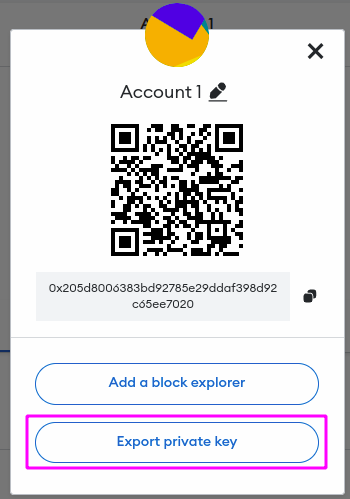
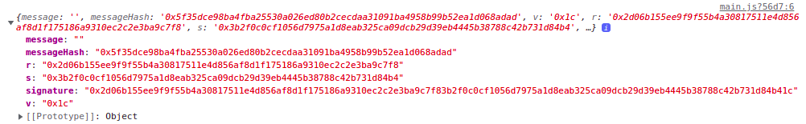
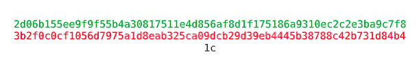
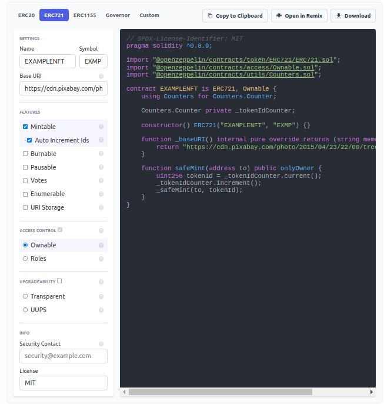
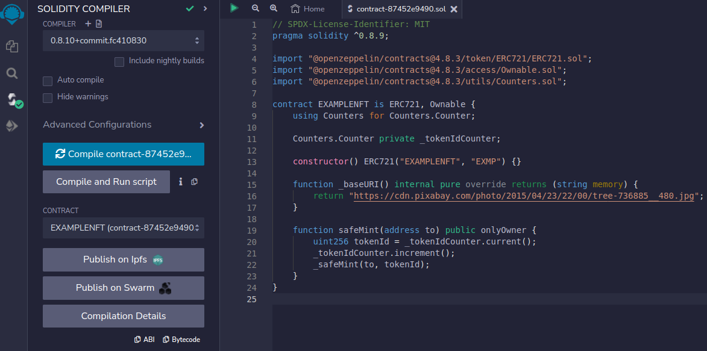
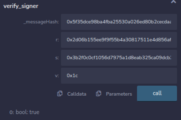

# USING SIGNATURES TO SECURE A CONTRACT ON CELO NETWORK:

## INTRODUCTION:

### What is a signature ? -

A signature refers to a cryptographic digital signature that is created using the private key of an account to verify the authenticity and integrity of a transaction or message.

When you want to send some tokens or interact with a contract, your wallet creates a “transaction” and sends it to a node on the CELO network which then broadcasts it to other nodes.When you initiate a transaction, you must prove to every node in the network that you are authorized to spend those funds.

A transaction is a message that contains information about the sender, recipient and the amount of tokens to be transferred (including a transaction fee).

### What is ECDSA Encryption ?  -

ECDSA(Elliptic Curve Digital Signature Algorithm) is a cryptographic algorithm used to ensure that funds can only be spent by their rightful owners. While the private key is a secret number, known only to the person that generated it.

### What is the purpose of using custom signatures ? -

For example, you have unprotected methods in your contract, so the people can execute them from outside your contract. To limit access to your contract, the best option would be to use signatures.

## REQUIREMENTS:

- A code editor to write JS code. For example: Install [VS Code](https://code.visualstudio.com/)
- Install [NodeJS](https://nodejs.org/en)
- Install [Metamask](https://metamask.io/)
- Add [Alfajores](https://medium.com/defi-for-the-people/how-to-set-up-metamask-with-celo-912d698fcafe) Testnet to Metamask.
- Claim [CELO](https://faucet.celo.org/alfajores) Testnet tokens.
  
## PRE-REQUISITE:

- Knowledge of [Solidity](https://docs.soliditylang.org) and [web3js](https://web3js.readthedocs.io/en/v1.8.2/)
- Understanding of how Blockchain and transactions work.

## Learning Outcomes:

- How to generate signatures using web3js?
- How signatures work?
- Two cases of using signatures.
 
## What We’ll Be Building? -

As a real-world example, we'll create a simple contract for an NFT mint and make transactions signing functionality for it.

# Let's get started:

Let's download the ready-made boilerplate project - [celo-boilerplate-web-dapp](https://github.com/dacadeorg/celo-boilerplate-web-dapp)

Next, we will write the following code in the main.js file.
We import the web3 library and create an object of this library to access its functions:

```js
// Import the Web3 library
import Web3 from "web3";

// Create a new Web3 instance with the Celo network provider
const web3 = new Web3(window.celo);

// Use the Web3 instance to sign the given data with the given private key
console.log(web3.eth.accounts.sign(data, privateKey));

```

To create a signature, we will use the web3.eth.accounts.sign function, which takes the following parameters:

1. data - String: The data to sign. In our case, we just need to check the person's wallet address to approve a signature, so we can leave the message blank. Of course, if you want to pass some kind of message that you will later use in your contract, you can do that.
2. privateKey - String: The private key to sign with. You can find this key in your wallet, for example, in a metamask.

[<p align="center"></p>][def]

It should be noted that the private key of the wallet must be stored in a safe place, for example you can use [dotenv](https://www.npmjs.com/package/dotenv).

Let's launch our site and go to the browser console. There we will see the result like this.

[<p align="center"></p>][def]

Let's take a look at the data we received.

- **message** - our message, which we left empty
- **messageHash** - message in encrypted form

To understand all other parameters, let's review the **signature** element.
The value 0x at the beginning is a prefix that allows the compiler to understand that the represented value is hexadecimal, so let's remove this value from the beginning.

Now, according to the [ECDSA algorithm](https://cryptobook.nakov.com/digital-signatures/ecdsa-sign-verify-messages), we will divide our **signature** element into parts of 64 characters each.

As a result, we will get such a view of the **signature** element.

[<p align="center"></p>][def]

The result shows that if we add the prefix 0x to each of these strings, we will get the same values ​​as in the **r**, **s**, **v** elements that we got in the console earlier.

This leaves us with the choice of passing a signature, a **signature** element, or the three **r**, **s**, **v** values. Well, there is no difference, although in the first option we will need to divide a **signature** in the contract itself. Consider the contract methods for both cases.

## CREATION OF A SIMPLE CONTRACT FOR NFT MINTING:

First, let's go to the [Remix](http://remix.ethereum.org/) for writing a Smart Contract on the CELO network.

> Remix IDE, is a no-setup tool with a GUI (Graphical User Interface) for developing Smart Contracts. Remix plays well with other tools, and allows for a simple deployment process to the chain of your choice. It is well-known for its visual debugger and other tools. 

> Using Remix IDE allows you to easily create, save and deploy contracts. Another important advantage is the emulation of the deployment of the contract with the help of an arranged "artificial" wallet, so to test the contract in local conditions, you do not even need to have a wallet and tokens to pay fees.

Since the method of creating signatures is suitable for any contract methods, we will make, for example, a contract for NFT mint.

To do this, go to https://docs.openzeppelin.com/contracts/4.x/wizard and enter the following settings.

[<p align="center"></p>][def]

We entered the name and symbol of our NFT, made it mintable (so that the user can mint it), selected "auto increment ID" and inserted a link that refers to some image.

A simple contract for NFT minting is ready, we can immediately open it in Remix by pressing the button on the right "Open in Remix".

Choose a compiler version not lower than the one specified in the initial contract, in my case, not lower than 0.8.9.

[<p align="center"></p>][def]

Next, contract code variants using the signature function will be presented. Please pay attention to the written comments, I tried to briefly explain what is happening and how. As a result, the code will look like this.

## First Usage Case:

```js
// SPDX-License-Identifier: MIT
pragma solidity ^0.8.9;

import "@openzeppelin/contracts/token/ERC721/ERC721.sol";
import "@openzeppelin/contracts/access/Ownable.sol";
import "@openzeppelin/contracts/utils/Counters.sol";
import "@openzeppelin/contracts/utils/cryptography/ECDSA.sol";

contract EXAMPLENFT is ERC721, Ownable {
   using Counters for Counters.Counter;

   Counters.Counter private _tokenIdCounter;

   // using ECDSA implementation by openzeppelin
   using ECDSA for bytes32;

   // address of a wallet we will compare signature owner with
   address private immutable owner_;

   constructor(address ownerAddress) ERC721("EXAMPLENFT", "EXMP") {
       owner_ = ownerAddress;
   }

   function _baseURI() internal pure override returns (string memory) {
       return "https://cdn.pixabay.com/photo/2015/04/23/22/00/tree-736885__480.jpg";
   }

   /**
   * @dev simple NFT mint function
    * @param to an address to mint an NFT
    * @param messageHash message hash, needs to verify a message
    * @param signature hash, needs to check if user allowed to mint an nft(if transaction was signed by owner)
    */ 
   function safeMint(address to, bytes32 messageHash, bytes memory signature) public onlyOwner {
       require(verify_signer(messageHash, signature), "You are not allowed to access this function");

       uint256 tokenId = _tokenIdCounter.current();
       _tokenIdCounter.increment();
       _safeMint(to, tokenId);
   }

   /**
   * @dev function to split a signature string
    * @param sig signature hash string
    * @return r first 32 bytes
    * @return s second 32 bytes
    * @return v final byte
    */
   function splitSignature(bytes memory sig) private pure returns (bytes32 r, bytes32 s, uint8 v){
     
      // to split a signature its length must be 65 = 32(r) + 32(s) + 1(v)
      require(sig.length == 65, "invalid signature length");

      assembly {
          /*
          First 32 bytes stores the length of the signature
          add(sig, 32) = pointer of sig + 32
          effectively, skips first 32 bytes of signature
          mload(p) loads next 32 bytes starting at the memory address p into memory
          */

          // first 32 bytes, after the length prefix
          r := mload(add(sig, 32))
          // second 32 bytes
          s := mload(add(sig, 64))
          // final byte (first byte of the next 32 bytes)
          v := byte(0, mload(add(sig, 96)))
      }
  }

   /**
   * @dev verifies an owner of a signature
    * @return bool
    */
  function verify_signer(bytes32 _messageHash, bytes memory _signature) private view returns (bool){
       (bytes32 r, bytes32 s, uint8 v) = splitSignature(_signature);

       // recover the signer address from the signature
       address signer = ECDSA.recover(_messageHash, v, r, s);

       // make sure the signer is not null
       require(signer != address(0), "ECDSA: invalid signature");

       // check if the signer is the owner
       return signer == owner_;
   }
}

```

In this example, the safeMint function accepts additional parameters messageHash and signature for signature authorization.

Note that openzeppelin's ECDSA implementation has been used, this fixes the following issues when using the standard ecrecover function:

1. In some cases ecrecover can return a random address instead of 0 for an invalid signature. This is prevented above by the owner address inside the typed data.
2. Signatures are malleable, meaning you might be able to create a second also valid signature for the same data. In our case we are not using the signature data itself (which one may do as an id for example).
3. An attacker can construct a hash and signature that looks valid if the hash is not computed within the contract itself.

## Second Usage Case:

Now let's write the second version of our code, where we know the variables v, r, s. In this case, we don't need the splitSignature function to split the signature.

```js
// SPDX-License-Identifier: MIT
pragma solidity ^0.8.9;

import "@openzeppelin/contracts/token/ERC721/ERC721.sol";
import "@openzeppelin/contracts/access/Ownable.sol";
import "@openzeppelin/contracts/utils/Counters.sol";
import "@openzeppelin/contracts/utils/cryptography/ECDSA.sol";

contract ExampleNFT is ERC721, Ownable {
using Counters for Counters.Counter;

  Counters.Counter private _tokenIdCounter;
address private _owner = 0x205D8006383Bd92785e29DDaf398D92c65EE7020;

constructor() ERC721("ExampleNFT", "EXMP") {}

function _baseURI() internal pure override returns (string memory) {
    return "https://cdn.pixabay.com/photo/2015/04/23/22/00/tree-736885__480.jpg";
}

function safeMint(address to, bytes32 messageHash, bytes32 r, bytes32 s, uint8 v) public onlyOwner {
    require(_verifySigner(messageHash, r, s, v), "You are not allowed to access this function");
    uint256 tokenId = _tokenIdCounter.current();
    _tokenIdCounter.increment();
    _safeMint(to, tokenId);
}

function _verifySigner(bytes32 messageHash, bytes32 r, bytes32 s, uint8 v) private view returns (bool) {
    address signer = ECDSA.recover(messageHash, v, r, s);
    require(signer != address(0), "Invalid signature");

       if (signer == owner_) {
           return true;
       }

       return false;
   }
}

```

The result of both options will be the same, so you can choose any of them.

To check, I have changed the scope of the verify_signer function from private to public, compiled the contract and to entered the signature values.

[<p align="center"></p>][def]

As a result, we got the value **true**, which means that the address of the owner of the signature matches the address specified in the contract

The presented methods of creating and signing transactions are simple, but they work like a charm, this will help us to keep the contract functions from outside access.

## CONCLUSION:

Therefore, signatures can be a powerful tool for securing contracts on the Celo network. By requiring a signature from a specific address, contracts can ensure that only authorized parties are able to execute certain functions or access sensitive information. Additionally, signatures can help prevent attacks such as replay attacks, where a signed message is reused in an attempt to trick a contract into executing a function multiple times. By implementing signature verification in their contracts, developers can help to ensure the security and integrity of their applications on the Celo network.

[def]: github_assets
